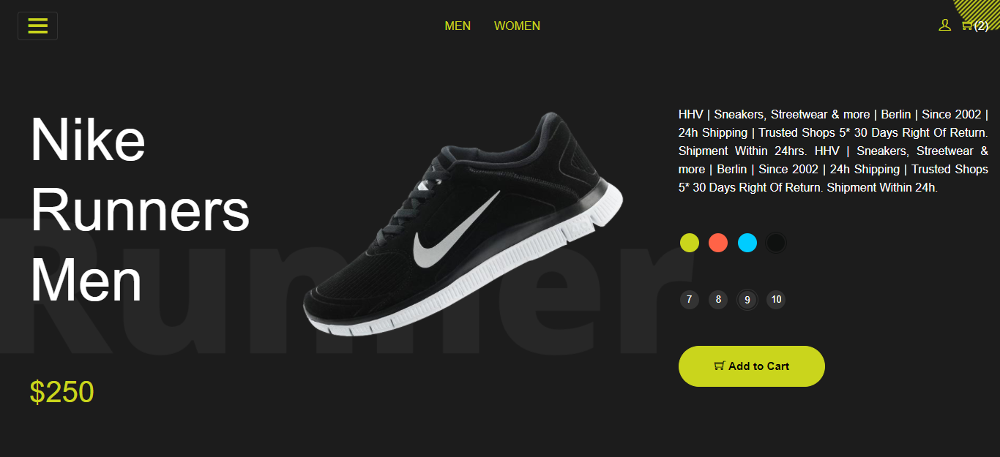
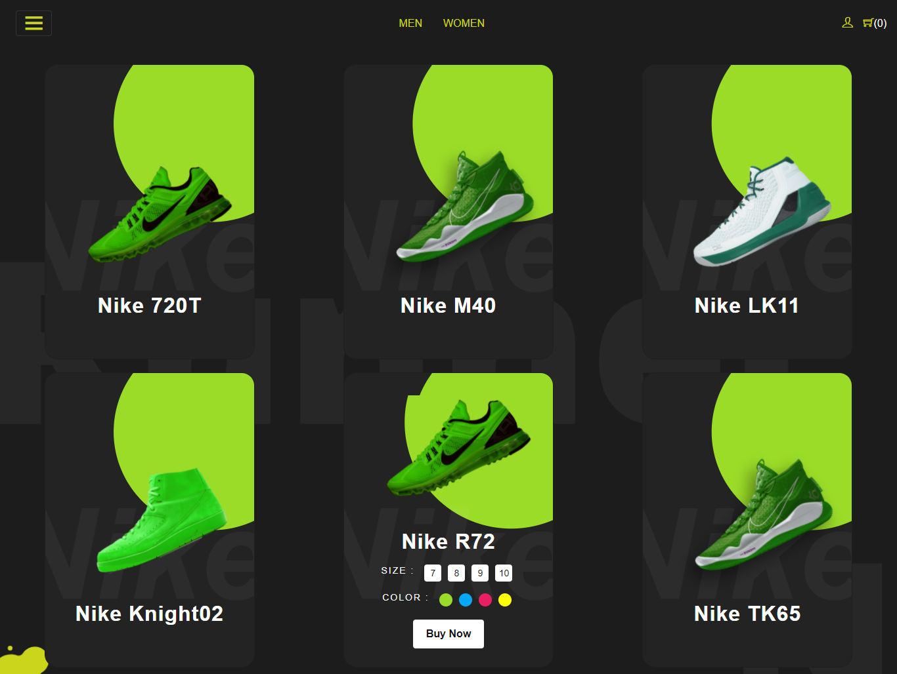
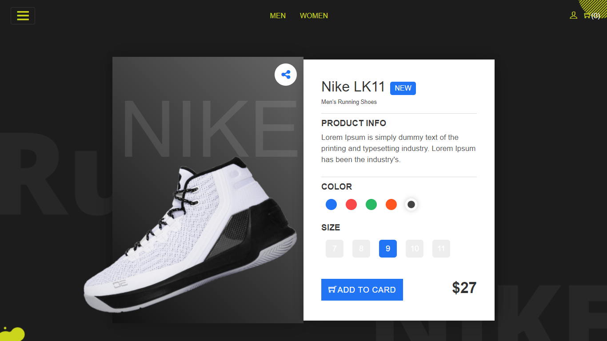
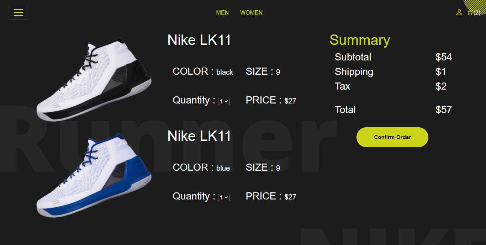
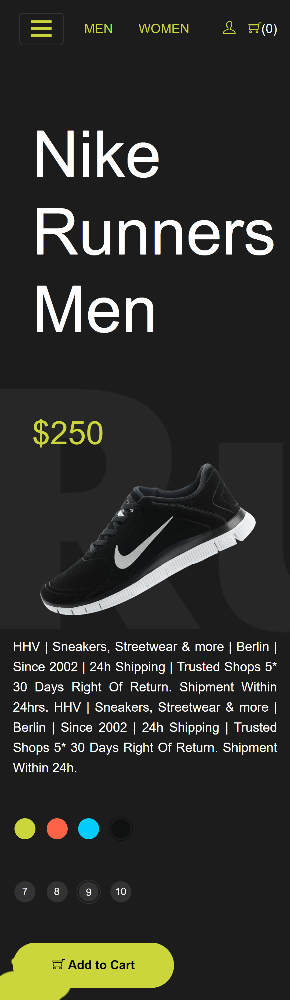
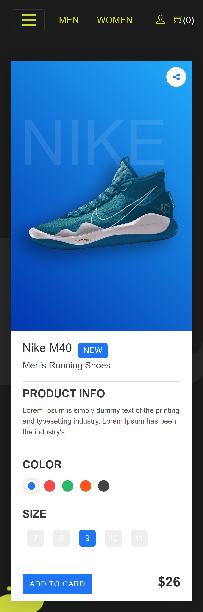
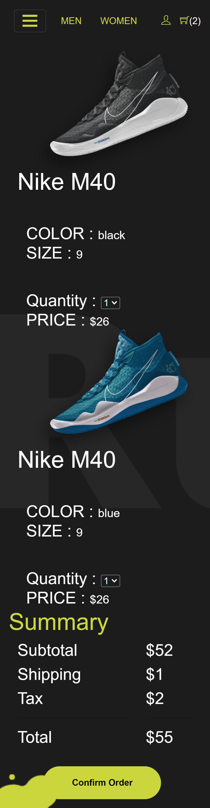

# Expense Tracker (PWA)

[Click here to test](https://boots-shop.surge.sh/)

It is Shoe shop app built on **Reactjs** <code></code>

# Features

- **Dynamic Color** (The color of shoes change on selecting different color)
- **Animation & Transitions** (It has very cool animations & transition mainly on shop page)
- **Cart Functionality** (You can add products to cart and It will calulate the total Trady to checkout🙂)
- **Responsive design** (fits on most of the devices very well..)

## Desktop Screenshots

   

## Mobile Screenshots

   
